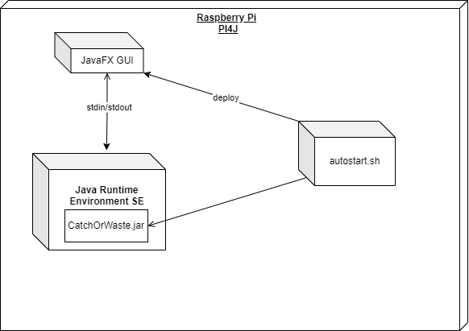

[[section-deployment-view]]
== Verteilungssicht

[role="arc42help"]

=== Infrastruktur Ebene 1

[role="arc42help"]

= Systembeschreibung

== JavaFX GUI
Die *JavaFX GUI* (Graphical User Interface) ist die Benutzeroberfläche der Anwendung. Sie wurde mit JavaFX erstellt, einer Java-Bibliothek zur Entwicklung von Desktop-Anwendungen. Diese GUI-Komponente ermöglicht Benutzern die Interaktion mit der Software. Sie bietet verschiedene Elemente wie Buttons, Textfelder, Dropdown-Menüs und andere Steuerelemente, die zur Eingabe und Anzeige von Daten verwendet werden.

Die GUI kommuniziert mit der *Java Runtime Environment SE* (JRE) über die Standard-Eingabe und -Ausgabe (stdin/stdout). Dies bedeutet, dass die Benutzerinteraktionen und die Ergebnisse der Berechnungen oder Prozesse innerhalb der GUI dargestellt werden und die Eingaben vom Benutzer an die JRE weitergeleitet werden.

== Java Runtime Environment SE (JRE)
Das *Java Runtime Environment SE* (JRE) ist die Laufzeitumgebung für Java-Anwendungen. Es stellt die notwendige Infrastruktur bereit, um Java-Programme auszuführen, einschließlich der Java Virtual Machine (JVM), Klassenbibliotheken und anderer Ressourcen. In diesem Kontext enthält die JRE das *CatchOrWaste.jar*-Archiv, welches die Hauptanwendung darstellt.

Die Datei *CatchOrWaste.jar* ist ein ausführbares Java-Archiv (JAR), das den gesamten Code und die Ressourcen für die Anwendung enthält. Diese Anwendung führt die Hauptlogik und die Prozesse aus, die vom Benutzer über die GUI initiiert werden. Sie kann verschiedene Aufgaben wie Datenverarbeitung, Berechnungen und andere geschäftslogische Operationen durchführen.

== autostart.sh
Das *autostart.sh*-Skript ist ein Shell-Skript, das dazu verwendet wird, die Anwendung beim Systemstart automatisch zu starten. Es enthält Befehle, um die Umgebung zu konfigurieren und die notwendigen Dienste zu initialisieren. Dieses Skript stellt sicher, dass die Anwendung nach einem Neustart des Systems ohne manuelles Eingreifen verfügbar ist.

Das Skript deployt auch die *JavaFX GUI* und sorgt dafür, dass die Benutzeroberfläche gestartet wird, sobald das System hochgefahren ist. Es ist eine wichtige Komponente, um die Betriebsbereitschaft der Anwendung zu gewährleisten und die Benutzererfahrung zu verbessern, indem es eine nahtlose und automatisierte Startsequenz bietet.

== Raspberry Pi und PI4J
Der *Raspberry Pi* ist der Hardware-Host für das gesamte System. Es handelt sich um einen kostengünstigen, kompakten Computer, der häufig für Projekte in der Elektronik und Softwareentwicklung verwendet wird. Der Raspberry Pi bietet alle notwendigen Ressourcen wie CPU, Speicher, und Schnittstellen für Peripheriegeräte, um die Anwendung auszuführen.

*PI4J* ist eine Java-Bibliothek, die speziell für die Interaktion mit der Hardware des Raspberry Pi entwickelt wurde. Sie ermöglicht es Java-Programmen, auf die GPIO-Pins (General Purpose Input/Output) des Raspberry Pi zuzugreifen und diese zu steuern. Dies ist besonders nützlich für Projekte, die Hardwaresteuerung erfordern, wie z.B. Sensoren, Motoren und andere elektronische Komponenten. PI4J stellt eine Brücke zwischen der Software und der Hardware des Raspberry Pi dar, was die Entwicklung von Hardware-nahen Anwendungen in Java erleichtert.

== Qualitäts- und/oder Leistungsmerkmale
Die Anwendung weist mehrere Qualitäts- und Leistungsmerkmale auf, die sie robust und benutzerfreundlich machen:
- **Stabilität**: Durch die Verwendung der Java Runtime Environment SE wird eine stabile und zuverlässige Laufzeitumgebung gewährleistet, die eine kontinuierliche Ausführung der Anwendung sicherstellt.
- **Benutzerfreundlichkeit**: Die JavaFX GUI bietet eine intuitive und leicht verständliche Benutzeroberfläche, die eine einfache Interaktion mit der Anwendung ermöglicht.
- **Automatischer Start**: Das autostart.sh-Skript stellt sicher, dass die Anwendung nach einem Systemneustart automatisch gestartet wird, was die Verfügbarkeit der Anwendung verbessert.
- **Hardware-Integration**: Durch die Verwendung von PI4J kann die Anwendung direkt mit der Hardware des Raspberry Pi interagieren, was eine flexible und leistungsfähige Steuerung von Peripheriegeräten ermöglicht.
- **Portabilität**: Die Anwendung kann auf verschiedenen Raspberry Pi Modellen betrieben werden, was eine hohe Flexibilität und Einsatzmöglichkeit in verschiedenen Szenarien bietet.

== Zuordnung von Bausteinen zu Infrastruktur
Die Zuordnung der einzelnen Bausteine zur Infrastruktur ist wie folgt:
- **Raspberry Pi**: Dient als Host für die gesamte Anwendung, bietet die Hardware-Ressourcen und das Betriebssystem.
- **PI4J**: Ist in die Anwendung integriert, um die Interaktion mit der Hardware des Raspberry Pi zu ermöglichen. Es stellt sicher, dass die Java-Anwendung die GPIO-Pins und andere Hardware-Komponenten steuern kann.
- **Java Runtime Environment SE (JRE)**: Läuft auf dem Raspberry Pi und bietet die notwendige Umgebung, um die Java-Anwendung auszuführen.
- **CatchOrWaste.jar**: Wird innerhalb der JRE ausgeführt und stellt die Hauptanwendung dar, die die Geschäftslogik und die Datenverarbeitung durchführt.
- **JavaFX GUI**: Läuft ebenfalls auf dem Raspberry Pi und bietet die Benutzerschnittstelle zur Interaktion mit der Anwendung.
- **autostart.sh**: Ist ein Shell-Skript, das beim Systemstart ausgeführt wird und sicherstellt, dass die gesamte Anwendung einschließlich der GUI automatisch gestartet wird.

Diese Struktur gewährleistet eine enge Integration der Software-Komponenten mit der Hardware und ermöglicht eine effiziente und zuverlässige Ausführung der Anwendung.
